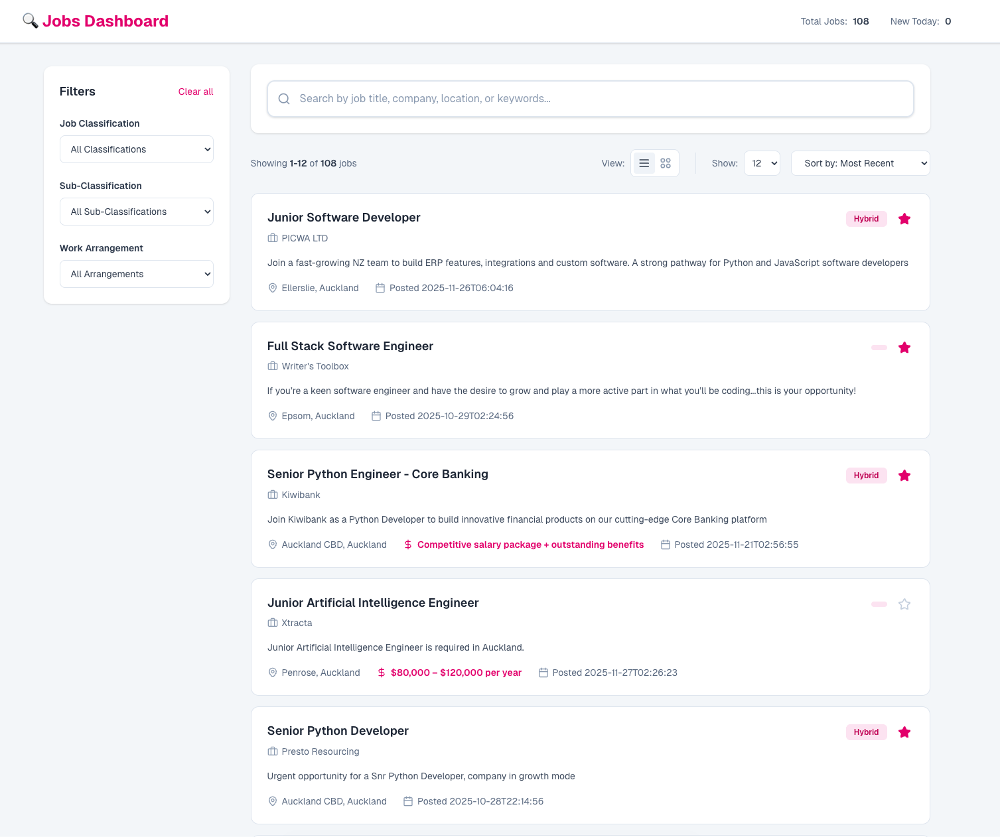
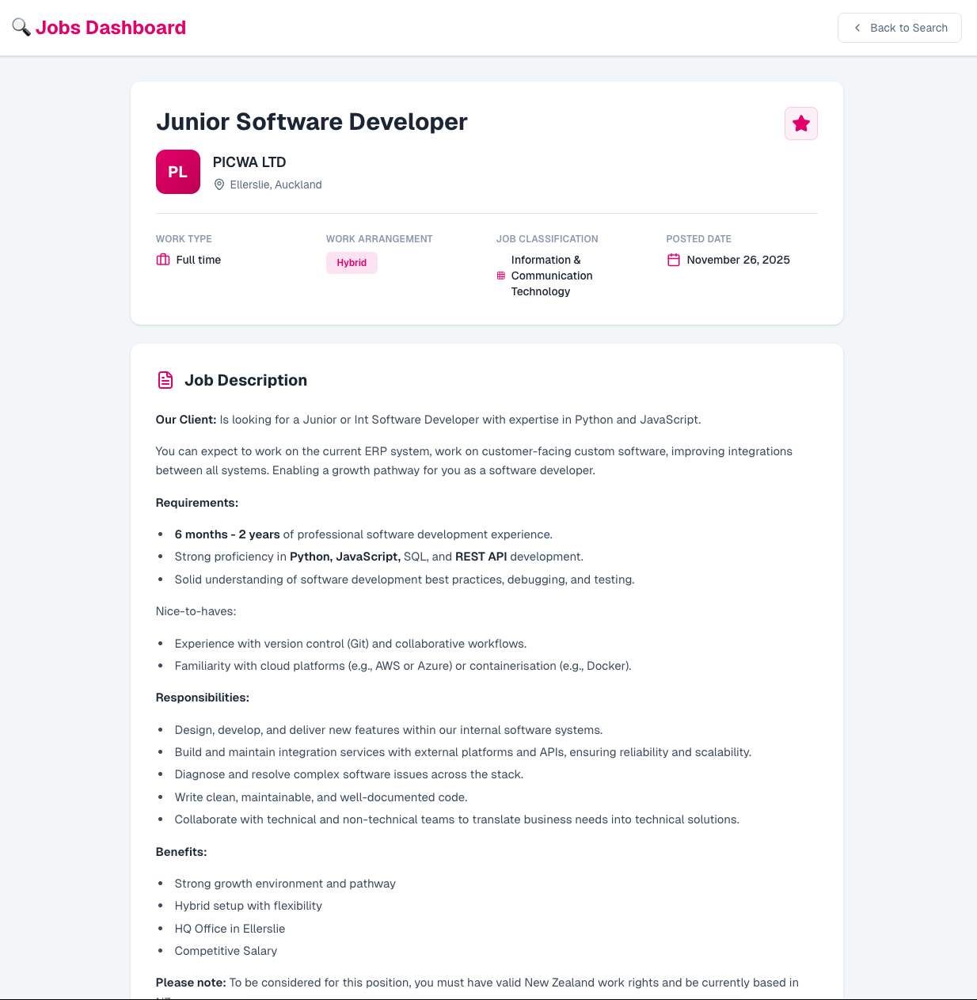
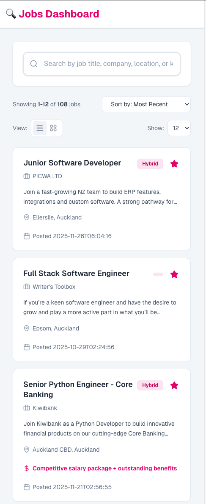
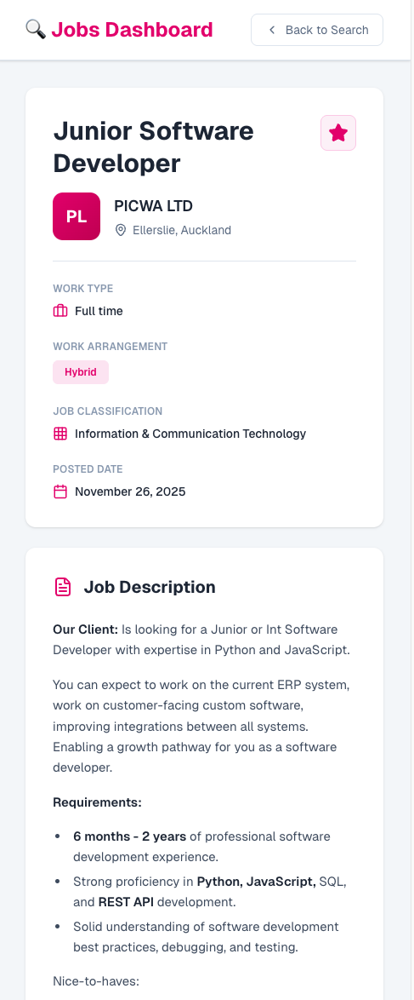

# Jobs Scraper App

A modern, responsive job board application built with [Next.js 16](https://nextjs.org) and React 19. This application provides a clean interface for browsing, searching, and managing job listings.


## 📸 Gallery

<div align="center">
  <h3>Desktop Dashboard</h3>
  
</div>

<br/>

<div align="center">
  <h3>Desktop Job Details</h3>
  
</div>

<br/>

<h3 align="center">Mobile View</h3>
<div align="center" style="display: flex; justify-content: center; gap: 20px;">
  
  
</div>


## 🚀 Features

- **Job Browsing**: detailed list of job opportunities with company logos, locations, and salary information.
- **Advanced Search**: Real-time search by keyword to find specific roles.
- **Filtering**: deeply integrated filtering by:
  - Classification & Sub-classification
  - Work Arrangement (Remote, Hybrid, On-site)
- **Sorting**: sort jobs by posting date, relevance, or company name.
- **Pagination**: Efficient server-side and client-side pagination handling.
- **Favorites System**: Save interesting jobs for later review (requires authentication).
- **Responsive Design**: Fully optimized for mobile, tablet, and desktop devices.
- **Job Details**: Rich text view of full job descriptions.

## 🛠️ Tech Stack

- **Framework**: [Next.js 16](https://nextjs.org/) (App Router)
- **Language**: [TypeScript](https://www.typescriptlang.org/)
- **Styling**: [Tailwind CSS 4](https://tailwindcss.com/)
- **Icons**: [Lucide React](https://lucide.dev/)
- **Testing**: [Vitest](https://vitest.dev/) & React Testing Library
- **State Management**: React Hooks (`use-jobs`, `use-job-search`)

## 🏁 Getting Started

### Prerequisites

- Node.js 18+ installed
- valid API backend running (default: `http://localhost:8000`)

### Installation

1. Clone the repository:
   ```bash
   git clone <repository-url>
   cd jobs-scraper-app
   ```

2. Install dependencies:
   ```bash
   npm install
   # or
   pnpm install
   ```

3. Configure Environment (Optional):
   Create a `.env.local` file if your API URL differs from default:
   ```env
   NEXT_PUBLIC_API_URL=http://localhost:8000
   NEXT_PUBLIC_API_KEY=your_api_key_optional
   ```

4. Run the development server:
   ```bash
   npm run dev
   ```

5. Open [http://localhost:3000](http://localhost:3000) with your browser.

## 📁 Project Structure

```
├── public/              # Static assets (images, icons)
├── src/
│   ├── app/             # Next.js App Router pages
│   ├── components/      # Reusable UI components (JobCard, Sidebar, etc.)
│   ├── hooks/           # Custom React hooks for data fetching
│   ├── services/        # API service layer
│   ├── styles/          # Global styles and Tailwind config
│   ├── types/           # TypeScript interfaces (Job, API)
│   └── __tests__/       # Unit and Integration tests
└── ...config files
```

## 📚 API Reference

For detailed documentation on the backend API endpoints, schemas, and authentication, please refer to the [Jobs Scraper API Repository](https://github.com/virgotagle/jobs-scraper-api).

---

Built with Next.js 16.
