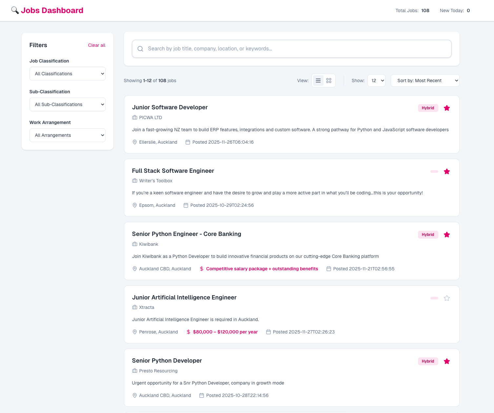
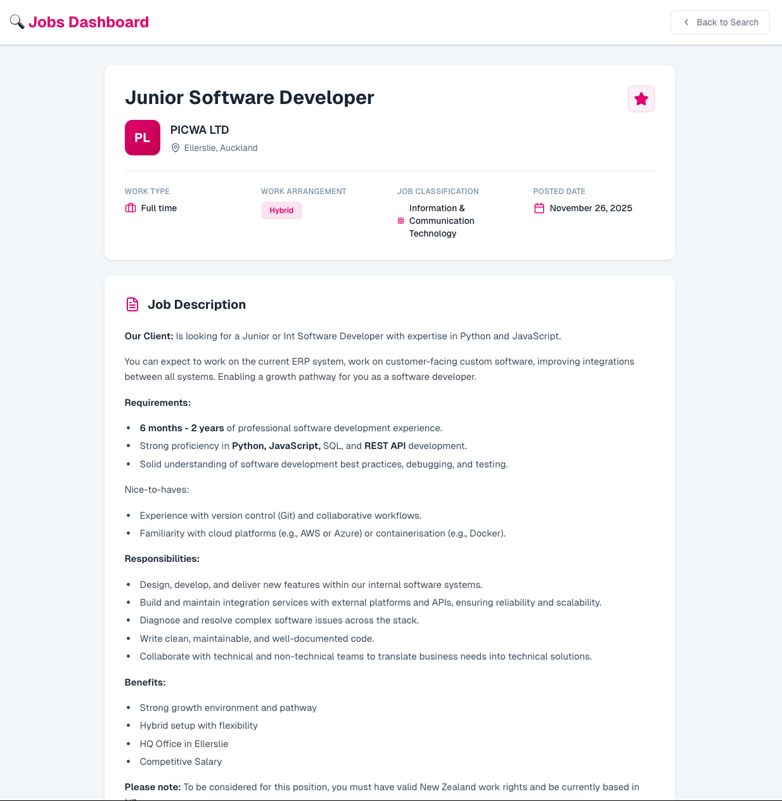
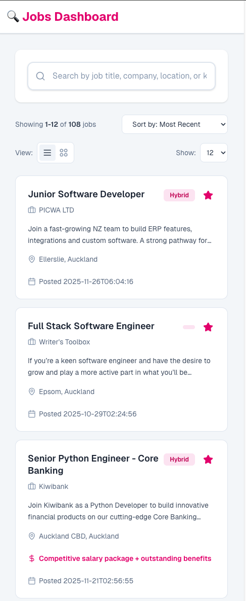
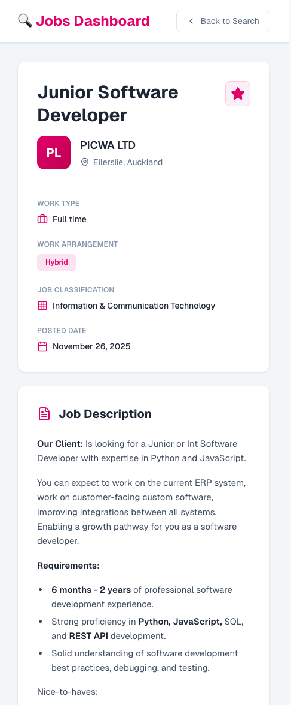

# Jobs Scraper Client

[](https://github.com/virgotagle/jobs-scraper-app/actions/workflows/ci.yml)
[](LICENSE)
[](https://nextjs.org/)
[](https://www.typescriptlang.org/)

> A Next.js frontend application that aggregates and displays job listings by consuming the [jobs-scraper-api](https://github.com/virgotagle/jobs-scraper-api), featuring optimistic UI updates and efficient client-side caching for a responsive user experience.

**Built with**: ⚛️ React 19 • ▲ Next.js 16 • 🔷 TypeScript 5 • 🍃 Tailwind CSS 4

## Overview

**Jobs Scraper Client** solves the problem of fragmented job searching by providing a unified, responsive dashboard for viewing aggregated listings. Unlike standard scraping viewers that are often static or slow, this application implements a dynamic, app-like experience with instant feedback.

The system implements a **Client-Server** architecture where the Next.js frontend acts as the consumer of a separate Python-based API. It strictly separates concerns between the UI (Components), Logic (Hooks), and Data Access (Services), enabling modular development and testing.

Key design decisions include:

- **Service Layer Facade**: All API interactions are routed through a typed service layer (`api.ts`), ensuring consistent error handling and authentication injection.
- **Optimistic UI Updates**: User actions like "favoriting" a job update the UI immediately (`useFavorite`), automatically reverting if the server request fails, creating a perceived zero-latency experience.
- **Mock-First Testing**: Integration tests run against Mock Service Worker (MSW) handlers (`src/__tests__/mocks/`), allowing the frontend to be tested in isolation without spinning up the backend.

## Features

### Core Experience

- ✅ **Responsive Dashboard**: Mobile-first layout adaptable to any screen size.
- ✅ **Real-time Search**: Debounced search functionality (`useJobSearch`) to filter listings efficiently.
- ✅ **Job Management**: Detailed views and "favoriting" system with persistence.

### Technical Capabilities

- ✅ **Strict Type Safety**: End-to-end type definitions for all API responses.
- ✅ **Resilient Data Fetching**: Centralized fetch wrapper with automatic error parsing.
- 🚧 **Advanced Filtering**: Multi-faceted filtering by location and job type (In Progress).

## Architecture

### Project Structure

```
jobs-scraper-app/
├── src/
│   ├── app/                # Next.js App Router pages (Views)
│   ├── components/         # Reusable UI components (Presentational)
│   ├── hooks/              # Custom React hooks (Business Logic)
│   ├── services/           # API client layer (Data Access)
│   ├── types/              # TypeScript definitions (Domain Model)
│   └── __tests__/          # Vitest & MSW configurations
├── public/                 # Static assets
└── .github/                # CI/CD workflows
```

### Component Interaction

```mermaid
graph TD
    User[User Interaction] --> Components[React Components]
    Components --> Hooks[Custom Hooks (useJobs)]
    Hooks --> Service[Service Layer (jobs.service)]
    Service --> API[API Client (fetchWrapper)]
    API --> Backend[External Python API]

    subgraph "Frontend State"
        Hooks
    end
```

### Core Components

| Component     | Location                       | Responsibility                                         |
| ------------- | ------------------------------ | ------------------------------------------------------ |
| `JobsService` | `src/services/jobs.service.ts` | Maps domain operations to API endpoints                |
| `useJobs`     | `src/hooks/use-jobs.ts`        | Manages job list state and loading lifecycles          |
| `ApiFacade`   | `src/services/api.ts`          | Centralizes `fetch` calls, headers, and error handling |

## Tech Stack & Patterns

### Tech Stack

| Category   | Technology   | Version | Purpose                                        |
| ---------- | ------------ | ------- | ---------------------------------------------- |
| Framework  | Next.js      | 16.0+   | React meta-framework for routing and streaming |
| UI Library | React        | 19.x    | Component-based UI rendering                   |
| Styling    | Tailwind CSS | 4.x     | Utility-first CSS styling                      |
| Icons      | Lucide React | 0.44+   | Consistent icon set                            |
| Testing    | Vitest       | 4.x     | Fast unit test runner                          |
| Mocking    | MSW          | 2.x     | Network request interception for tests         |

### Design Patterns

| Pattern           | Implementation              | Rationale                                                     |
| ----------------- | --------------------------- | ------------------------------------------------------------- |
| **Facade**        | `src/services/api.ts`       | Hides the complexity of `fetch` configuration / Auth headers. |
| **Repository**    | `src/services/*.service.ts` | Decouples UI components from specific API endpoints.          |
| **Optimistic UI** | `src/hooks/use-favorite.ts` | Updates state before server confirmation for better UX.       |

## Getting Started

### Prerequisites

| Requirement | Version | Check Command    |
| ----------- | ------- | ---------------- |
| Node.js     | 20+     | `node --version` |
| pnpm        | 9+      | `pnpm --version` |
| Python API  | 1.0+    | (See API docs)   |

### Installation

```bash
# Clone repository
git clone https://github.com/virgotagle/jobs-scraper-app.git
cd jobs-scraper-app

# Install dependencies
pnpm install
```

### Configuration

Create `.env.local` file from example:

```bash
cp .env .env.local
```

| Variable              | Required | Default                 | Description                           |
| --------------------- | -------- | ----------------------- | ------------------------------------- |
| `NEXT_PUBLIC_API_URL` | No       | `http://127.0.0.1:8000` | URL of the locally running Python API |
| `NEXT_PUBLIC_API_KEY` | No       | `''`                    | API Key if backend requires auth      |

### Verify Installation

```bash
# Run unit tests (Mocked)
pnpm test:unit

# Expected output:
# ✓ src/__tests__/unit/jobs.test.tsx (5 tests)
```

## Usage

### Development Server

Start the application in development mode with hot-reloading:

```bash
pnpm dev
# App will listen on http://localhost:3000
```

### Production Build

Create an optimized interaction build:

```bash
pnpm build
pnpm start
```

## Development

### Quality Assurance

| Tool       | Purpose     | Command                  |
| ---------- | ----------- | ------------------------ |
| **Vitest** | Unit Tests  | `pnpm test:unit`         |
| **ESLint** | Linting     | `pnpm lint`              |
| **MSW**    | API Mocking | Used internally by tests |

**CI Pipeline** (`.github/workflows/ci.yml`):

- Triggers: Push/PR to `main`
- Stages: `Lint` → `Test` → `Build`
- Cache: Caches `pnpm` store for faster builds

### Adding a New Feature

**Example: Adding a "Hide Job" button**

1.  **Update Service**: Add method to `src/services/jobs.service.ts`
    ```typescript
    hideJob: (jobId: string) => api.post(`/jobs/${jobId}/hide`);
    ```
2.  **Create Hook**: Add logic to `src/hooks/use-jobs.ts`
    ```typescript
    const hideJob = async (id) => {
      /* logic */
    };
    ```
3.  **Update Component**: Add button to `JobCard.tsx`
    ```tsx
    <button onClick={() => hideJob(job.id)}>Hide</button>
    ```

## Deployment

### Docker

```bash
# Build the image
docker build -t jobs-scraper-app .

# Run container
docker run -p 3000:3000 -e NEXT_PUBLIC_API_URL="https://api.example.com" jobs-scraper-app
```

### Vercel (Recommended)

This project is optimized for Vercel. Connect your repository and add the `NEXT_PUBLIC_API_URL` environment variable in the dashboard.

## Troubleshooting

### Common Issues

<details>
<summary><strong>API Connection Refused</strong></summary>

**Cause**: The backend API is not running or running on a different port.

**Solution**:

1. Ensure the `jobs-scraper-api` is running (`uvcorn src.main:app`).
2. Verify `NEXT_PUBLIC_API_URL` in `.env.local` matches the backend URL.
</details>

<details>
<summary><strong>Typescript Errors on Build</strong></summary>

**Cause**: Mismatched types between frontend and API response.

**Solution**:
Run `pnpm build` locally before pushing. Check `src/types/` for outdated interfaces.

</details>

## Gallery

<div align="center">
  <h3>Desktop Dashboard</h3>
  
</div>

<br/>

<div align="center">
  <h3>Desktop Job Details</h3>
  
</div>

<br/>

<h3 align="center">Mobile View</h3>
<div align="center" style="display: flex; justify-content: center; gap: 20px;">
  
  
</div>

## License

This project is licensed under the MIT License - see [LICENSE](LICENSE) for details.
